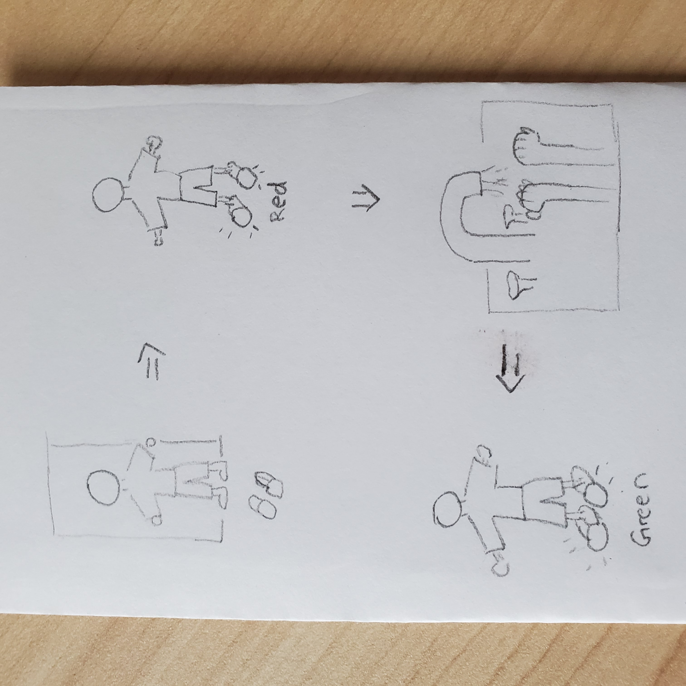
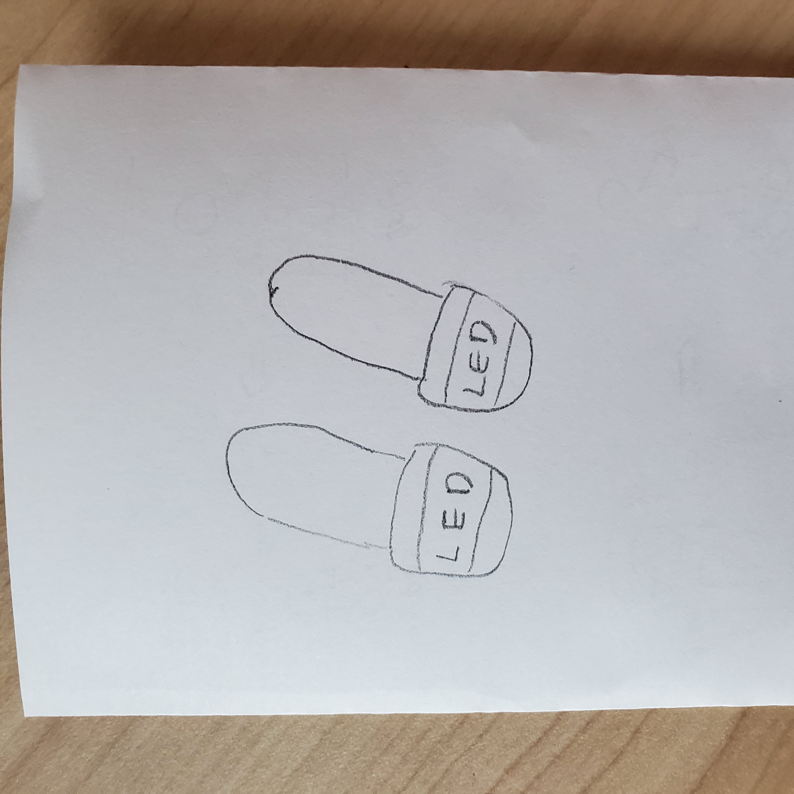
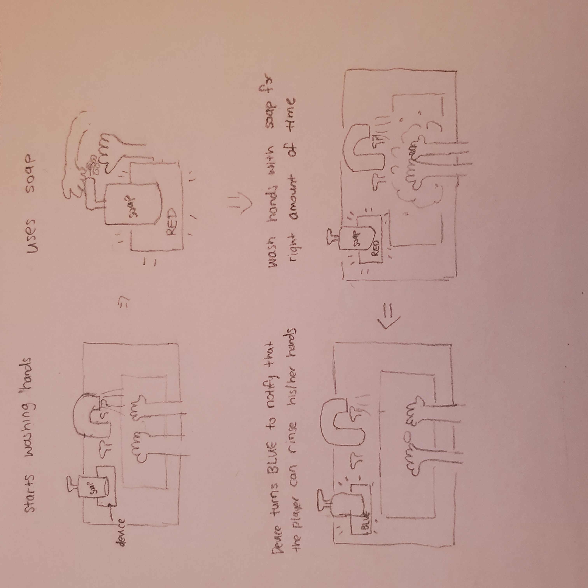
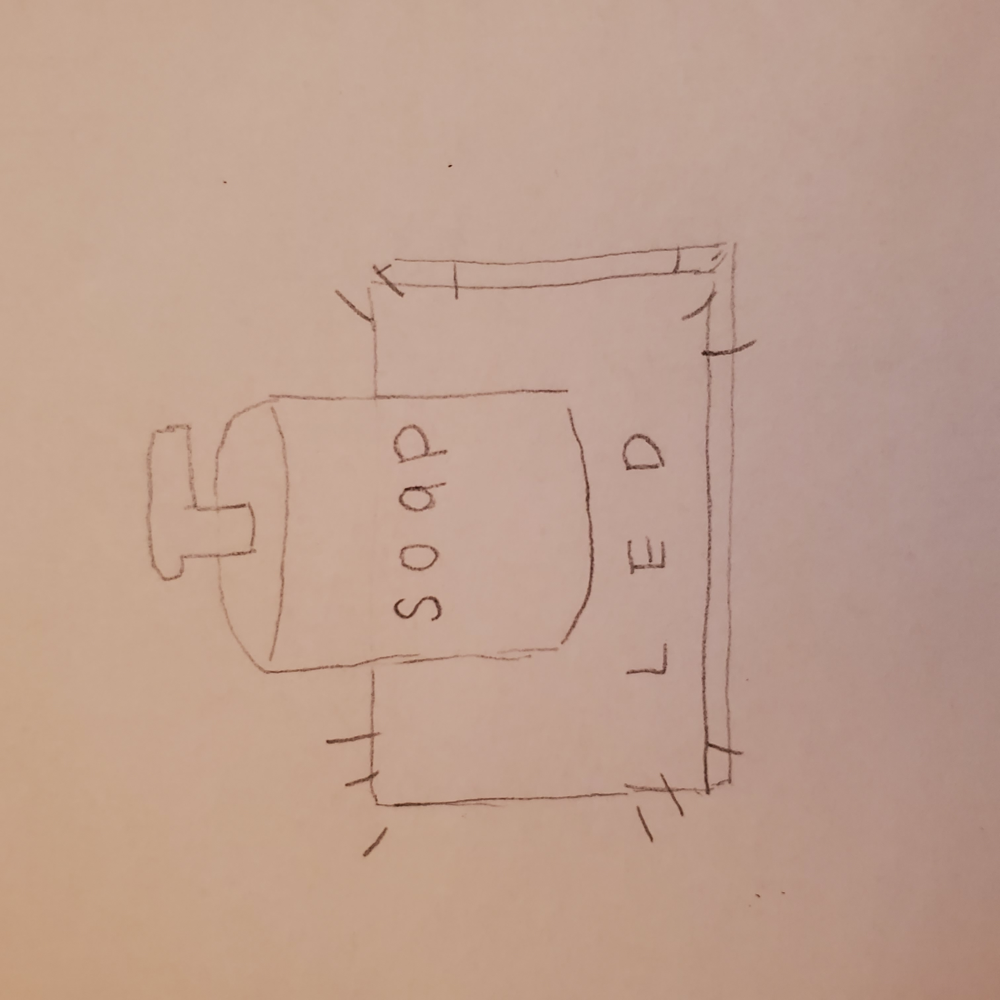

# Staging Interaction

In the original stage production of Peter Pan, Tinker Bell was represented by a darting light created by a small handheld mirror off-stage, reflecting a little circle of light from a powerful lamp. Tinkerbell communicates her presence through this light to the other characters. See more info [here](https://en.wikipedia.org/wiki/Tinker_Bell). 

There is no actor that plays Tinkerbell--her existence in the play comes from the interactions that the other characters have with her.

For lab this week, we draw on this and other inspirations from theatre to stage interactions with a device where the main mode of display/output for the interactive device you are designing is lighting. You will plot the interaction with a storyboard, and use your computer and a smartphone to experiment with what the interactions will look and feel like. _Make sure you read all the instructions and understand the whole of the laboratory activity before starting!_

## Prep

1. Set up [your Github "Lab Hub" repository](../../../) by [following these instructions](https://github.com/FAR-Lab/Developing-and-Designing-Interactive-Devices/blob/2021Spring/readings/Submitting%20Labs.md).
2. Set up the README.md for your Hub repository (for instance, so that it has your name and points to your own Lab 1) and [learn how](https://guides.github.com/features/mastering-markdown/) to post links to your submissions on your readme.md so we can find them easily.

### For lab, you will need:

1. Paper
1. Markers/ Pen
1. Smart Phone--Main required feature is that the phone needs to have a browser and display a webpage.
1. Computer--we will use your computer to host a webpage which also features controls
1. Found objects and materials--you’ll have to costume your phone so that it looks like some other device. These materials can include doll clothes, a paper lantern, a bottle, human clothes, a pillow case. Be creative!
1. Scissors

### Deliverables for this lab are: 
1. Storyboard
1. Sketches/photos of costumed device
1. Any reflections you have on the process.
1. Video sketch of the prototyped interaction.
1. Submit these in the lab1 folder of your class [Github page], either as links or uploaded files. Each group member should post their own copy of the work to their own Lab Hub, even if some of the work is the same for each person in the group.

## Overview
For this assignment, you are going to 

A) [Plan](#part-a-plan) 

B) [Act out the interaction](#part-b-act-out-the-interaction) 

C) [Prototype the device](#part-c-prototype-the-device)

D) [Wizard the device](#part-d-wizard-the-device) 

E) [Costume the device](#part-e-costume-the-device)

F) [Record the interaction](#part-f-record)

## The Report
This readme.md page in your own repository should be edited to include the work you have done. You can delete everything but the headers and the sections between the **stars**. Write the answers to the questions under the starred sentences. Include any material that explains what you did in this lab hub folder, and link it in the readme.

Labs are due on Mondays. Make sure this page is linked to on your main class hub page.

## Part A. Plan 
**Setting**: My apartment

**Players**: Anyone who enters my apartment

**Activity & Goal**: The interactive device will be indoor slippers that the player would wear when entering my apartment. When the player enters my apartment and slips on the device, the slippers will luminate red light to indicate that the player has not yet washed his or her hands. When the player washes his or her hands, the device will luminate blue light to indicate that the player has washed his or her hands.

**Storyboard**

**Feedbacks**
1. Instead of illuminating green light when the player has finished washing his or her, the device should turn the light off.
2. Device should include a tracking method to check if the player has properly washed his or her hands.

## Part B. Act out the Interaction

**Are there things that seemed better on paper than acted out?**

There are certainly few questions that needs to be answered in order for this device to work well. One, how can the device make sure that the player has washed his or hands? Two, what will happen if the player temporarily takes the slippers off and put them back on? 

**Are there new ideas that occur to you or your collaborators that come up from the acting?**

Ideally, this device would be better if it was a robot that followed each player around or kept track of players in the apartment. However such device would be much more costly to make. Another idea could be multiple screen-like devices that are set up throughout the apartment and keep track of players washing their hands.

## Part C. Prototype the device

You will be using your smartphone as a stand-in for the device you are prototyping. You will use the browser of your smart phone to act as a “light” and use a remote control interface to remotely change the light on that device. 

Code for the "Tinkerbelle" tool, and instructions for setting up the server and your phone are [here](https://github.com/FAR-Lab/tinkerbelle).

We invented this tool for this lab! 

If you run into technical issues with this tool, you can also use a light switch, dimmer, etc. that you can can manually or remotely control.

**Give us feedback on Tinkerbelle.**

## Part D. Wizard the device
Take a little time to set up the wizarding set-up that allows for someone to remotely control the device while someone acts with it. Hint: You can use Zoom to record videos, and you can pin someone’s video feed if that is the scene which you want to record. 

**Include your first attempts at recording the set-up video here.**

Tinkerbell set-up video: https://drive.google.com/file/d/1CxkryKeKZIs9j7lnU4-nm5q6sX0MlOKr/view?usp=sharing

Now, hange the goal within the same setting, and update the interaction with the paper prototype. 

**Show the follow-up work here.**

Interaction with paper prototype: https://drive.google.com/file/d/1KlOvGEn5rkkREYKVRfG9IbThPLZF6FY0/view?usp=sharing

## Part E. Costume the device

Only now should you start worrying about what the device should look like. Develop a costume so that you can use your phone as this device.

Think about the setting of the device: is the environment a place where the device could overheat? Is water a danger? Does it need to have bright colors in an emergency setting?

**Include sketches of what your device might look like here.**

**What concerns or opportunitities are influencing the way you've designed the device to look?**

Since players will need to slip on the device on their feet, the device have to be designed so that they are durable from possible weight that people might give. I have to make sure that the lights do not break when people step on the device. Also, since people will be wearing them when they are washing their hands, the device should be at least partially resistant to water.

## Part F. Record

**Take a video of your prototyped interaction.**

https://drive.google.com/file/d/1KxP8zd-qt-TnzsO4tqvaEh1gakjBXuxj/view?usp=sharing

**Please indicate anyone you collaborated with on this Lab.**

Rob Gentul, Ross Kleinrock, and William Zhang for giving feedbacks on my idea. My wife for taking the video for me.

# Staging Interaction, Part 2 

This describes the second week's work for this lab activity.

## Prep (to be done before Lab on Wednesday)

You will be assigned three partners from another group. Go to their github pages, view their videos, and provide them with reactions, suggestions & feedback: explain to them what you saw happening in their video. Guess the scene and the goals of the character. Ask them about anything that wasn’t clear. 

**Feedback from Rob Gentul**

Great concept! Very important nowadays especially to wash those hands. I think your concept video does a great job demoing the product without needing any explanation from you during the video. I’d perhaps incorporate a chime at the outset of the video, so that the person entering the apartment is alerted to the presence of your device.

**Feedback from Ross Kleinrock**

Love the creativity and ingenuity here, also think it’s a very cool and timely idea
It looks like when someone puts on the slipper it shows a red indicator light until they wash their hands and they’re cleared
Might make sense to put the indicator up higher closer to eye-level, may be kind of tough to see on people’s feet. It also looks tough to walk with
A simple binary yes/no leaves some question: when did they wash last? Have they touched anything since? Did they use soap with the water? Sink or Sanitizer? How long did they wash for if they used the sink? .. maybe some of these things could be indicated with sounds, or  different colors (instead of just blue)

**Feedback from William Zhang**

I thought your idea was quite interesting and funny at the same time. I think the idea of communicating the status of the hands through slipper colors can be extended so that other things can be communicated.

## Make it your own

Do last week’s assignment again, but this time: 
1) It doesn’t have to (just) use light, 
2) You can use any modality (e.g., vibration, sound) to prototype the behaviors, 
3) We will be grading with an emphasis on creativity. 

## Plan

**Setting:** My apartment

**Players:** Anyone who enters my apartment

**Activity & Goal:** The interactive device in part 2 will work in conjunction with the device from part 1. This device will be located in the bathroom sink underneath the handsoap. The device will make sure that the person has washed his or her hands for proper amount of time (approximately 20 seconds). When the person uses the soap, the device will turn on and luminate red light indicating that he/she has not yet washed his/her hands for suggested amount of time. When the person has washed his/her hand for suggested amount of time, the device will luminate blue light to indicate that he/she can rinse his/her hands. This device will be connected to the indoor slippers in part 1 so that when the person has properly washed his/her hands, the slippers will also turn blue.

**Storyboard**

## Act out the Interaction ##

**Are there things that seemed better on paper than acted out?**

There are certainly some loop holes around cheating the device such as ignoring the light and rinsing hands earlier than suggested time. However, it certainly could be ways to help people get in the habit of washing their hands more properly.

**Are there new ideas that occur to you or your collaborators that come up from the acting?**

I think it could also be helpful if there were some notifications or instructions as to how people should be washing their hands. For instance, at certain time intervals, it could instruct the person washing his/her hands to focus on washing their palms, forehand, or nails, to make the device more interactive.

## Costume the device ##

**Device Sketch**

**What concerns or opportunitities are influencing the way you've designed the device to look?**

Since the device will be located on top of the bathroom sink and below the soap, the device should be certainly be waterproof. The device should not be too large since some bathroom sinks may not have too much space. However, it should also not be too small so that it can be used with different types and sizes of handsoaps.

## Record ##

**Take a video of your prototyped interaction**

Note that video is made out to show how I imagined the two devices in part 1 and 2 would work in conjunction with each other.

https://drive.google.com/file/d/1NC8uh9J7ApMas_CAxUA9C7p_7qhWhQaZ/view?usp=sharing
